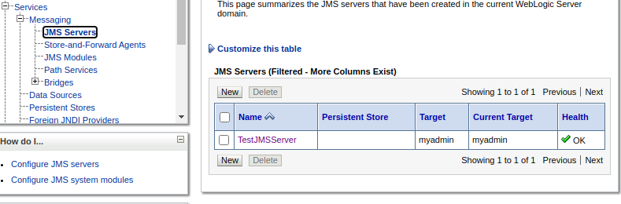
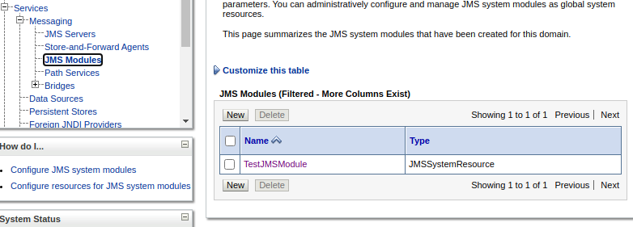
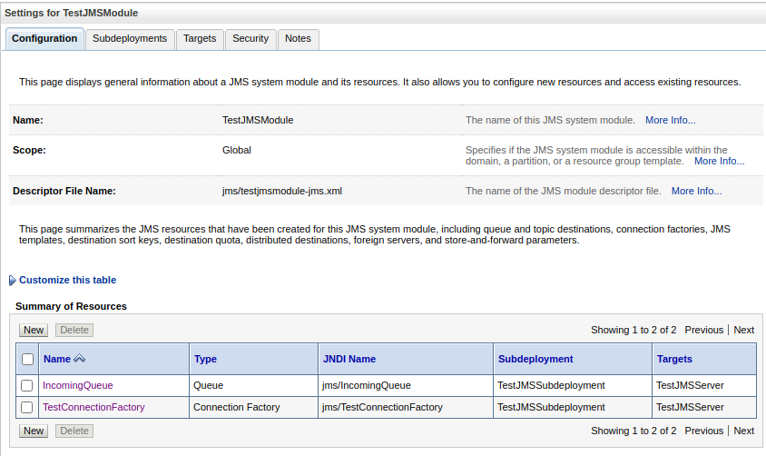

# Helidon MP JMS Messaging with WLS JMS

POC for using SmallRye JMS connector with Helidon Messaging

NOTICE: 
* SmallRye JMS connector jar is missing bean.xml - workaround is possible 
  with registering connector bean manually see `SmallryeJMSCompatibilityExtension`
* Tested with Weblogic 12.2.1.3

## Setup JMS Queue in WLS

* Prepare JMS server


* JMS module


* Connection factory and queue


## Build and run Helidon app
```shell script
# Install wlthint3client.jar to local msv repo
mvn install:install-file \
-Dfile=./wlthint3client.jar \
-DgeneratePom=true \
-DgroupId=custom.com.oracle \
-DartifactId=wlthint3client \
-Dversion=12.2.1.3 \
-Dpackaging=jar

mvn package
java -jar target/jms-sr.jar

curl -X GET http://localhost:8080/send/test1

>>Message: test1
```
